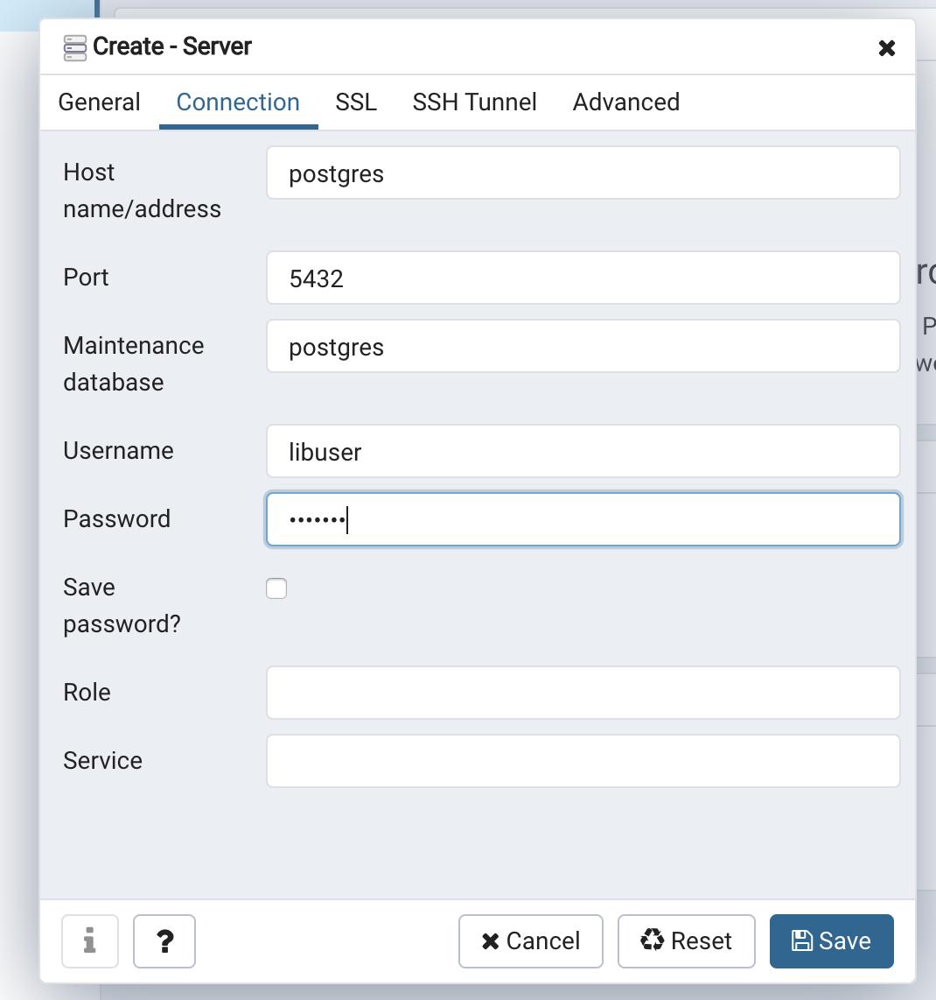

## やり残し一覧
* swaggerでAPI生成してみたい
* ORMapperつかってない、JPAてきなのつかってみたい
* ところどころテストが抜けている
* SpringBootTestがいくつかある
* ISBN13桁を無視している
* 例外がRuntime
* 本をイミュータブルにして、イベントソーシング的なことをやってみたい
* 本棚はEntityなのか、IDがない、APに一個しかない
* Repository実装クラスに集約内部の、Bookのコンストラクタが漏れている
* バリデーションをしていない
* 本の購入管理とかやりたい

## １冊借りるときのURL
```
http://localhost:8080/api/v1/books/{isbn} <= 10桁だけ
（例）http://localhost:8080/api/v1/books/1111111111　
```

## Run App

```shell script
cd library-backend-service
./gradlew bootRun
```

## Scripts

### Run Unit Tests

``` shell script
./scripts/run-unit-tests.sh
```

### Run Tests & Push

```shell script
./scripts/ship-it.sh
```

## PostgreSQL Database Setup

``` shell script
cd tools/
docker-compose up -d
```

- Access to pgAdmin
    - http://localhost:8000
    - pgadmin / pgadmin
    - Connection
        - 
        
